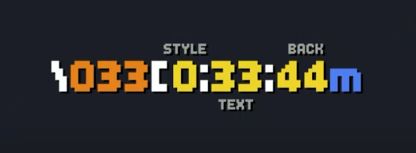
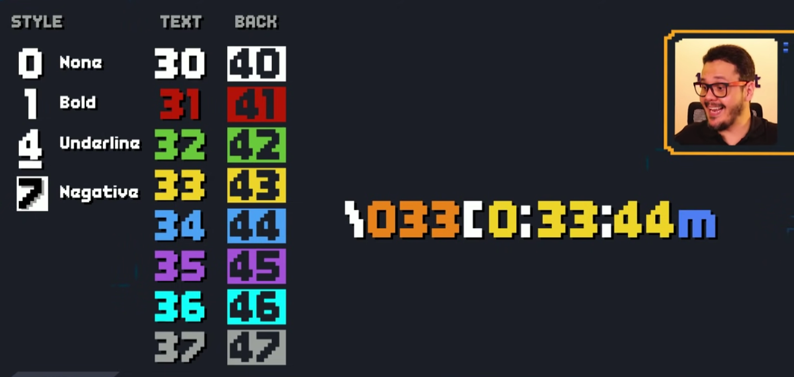
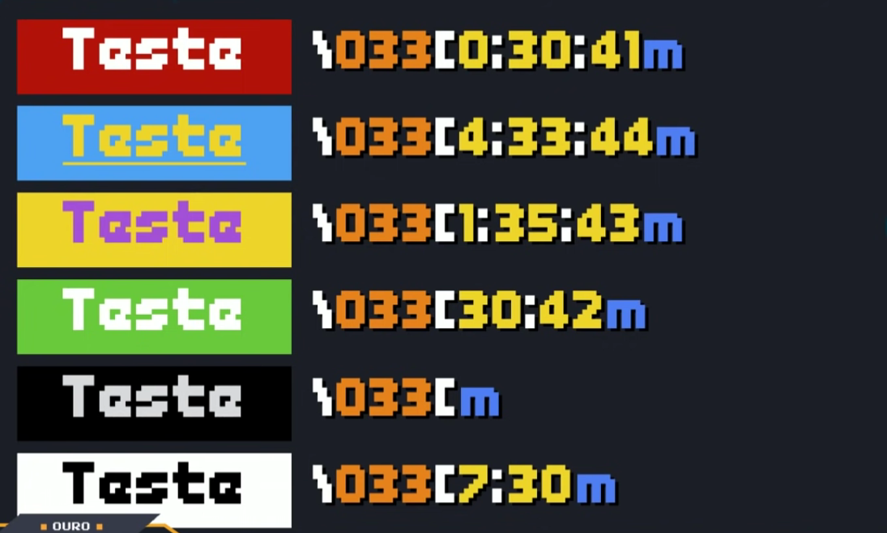

# Cores no Terminal

- Nessa aula, vamos aprender como utilizar os códigos de escape sequence ANSI (Escape Sequences) para configurar cores para os seus programas em Python.
- Vamos usar o código ANSI para modificar as cores no terminal. No entanto, observe que a compatibilidade pode variar em diferentes terminais.

## 1ª Forma de Utilizar
```py
# Cores no terminal com Python

# Códigos ANSI para estilos, cores e background
S_RESET = "\033[0m" # or \033[m
S_BOLD = "\033[1m"
S_UNDERLINE = "\033[4m"
S_REVERSE = "\033[7m"

C_BLACK = "\033[30m"
C_RED = "\033[31m"
C_GREEN = "\033[32m"
C_YELLOW = "\033[33m"
C_BLUE = "\033[34m"
C_MAGENTA = "\033[35m"
C_CYAN = "\033[36m"
C_GRAY = "\033[37m"
C_WHITE = "\033[97m"

B_BLACK = "\033[40m"
B_RED = "\033[41m"
B_GREEN = "\033[42m"
B_YELLOW = "\033[43m"
B_BLUE = "\033[44m"
B_MAGENTA = "\033[45m"
B_CYAN = "\033[46m"
B_GRAY = "\033[47m"
B_WHITE = "\033[107m"

# Função para imprimir cor
def print_color(text, color):
    print(color + text + S_RESET)

# Exemplos de uso
print_color("Texto em vermelho", C_RED)
print_color("Texto em verde", C_GREEN)
print_color("Texto em amarelo", C_YELLOW)
print_color("Texto em azul", C_BLUE)
print_color("Texto em ciano", C_CYAN)
print_color("Texto em magenta", C_MAGENTA)
print_color("Texto em cinza", C_GRAY)
print_color("Texto em branco", C_WHITE)
print_color("Texto em negrito", S_BOLD)
print_color("Texto sublinhado", S_UNDERLINE)

# Combinando estilos
print_color("Text verde em negrito e sublinhado", C_GREEN + S_BOLD + S_UNDERLINE)
```

### Explicação do código:

- Os códigos ANSI são sequências de escape que começam com `\033[` e são usados para formatar a saída do terminal.
- `S_RESET` é usado para redefinir as configurações de cor para o padrão (e não colocar cor nos outros caracteres a seguir no terminal).
- As variáveis `C_RED`, `C_GREEN`, etc., contêm códigos para diferentes cores.
- A função `print_color` recebe um texto e uma cor e imprime o texto na cor especificada.
- Exemplos de uso mostram como imprimir texto em várias cores, estilos e combinações.

## 2ª Forma de Utilizar

### Esquema



### Códigos de Estilização



> OBS: os códigos `30` e `40` na realidade expressa a cor preta.  

### Demonstração

Visual:



No código:

```py
print('\033[0;37;41mTest\033[m')
print('\033[4;33;44mTest\033[m')
print('\033[1;35;43mTest\033[m')
print('\033[37;42mTest\033[m')
print('\033[mTest\033[m')
print('\033[7;37mTest\033[m')
```